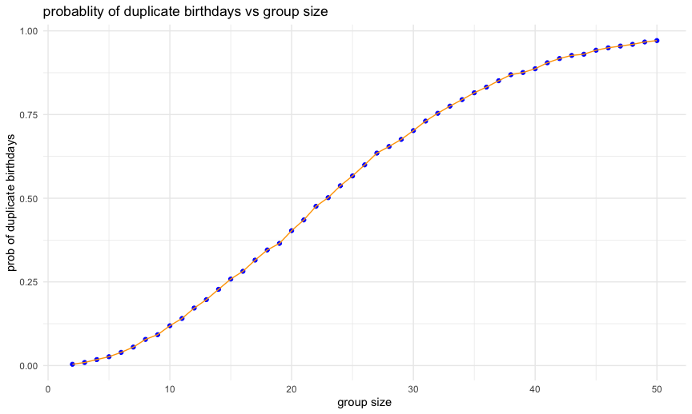

p8105_hw5_lk2776
================
2024-11-05

``` r
#load packages
library(tidyverse)
library(ggridges)
library(patchwork)
library(purrr)
library(broom)
library(ggplot2)

#R figure settings
knitr::opts_chunk$set(
  fig.width = 9,
  fig.asp = .6,
  out.width = "90%"
)
theme_set(theme_minimal() + theme(legend.position = "bottom"))

options(
  ggplot2.continuous.colour = "viridis",
  ggplot2.continuous.fill = "viridis"
)

scale_colour_discrete = scale_colour_viridis_d
scale_fill_discrete = scale_fill_viridis_d
```

## problem1

``` r
b_day_func = function(group_size) {
  #random birthday generation for each group
  sim_b_data = sample(1:365, group_size, replace=TRUE)
  
  any(duplicated(sim_b_data)) #check - one output 
}

b_day_func(1)
```

    ## [1] FALSE

``` r
b_day_func(100)
```

    ## [1] TRUE

``` r
sim_results_df_p1 = 
  expand_grid(
    group_sizes = seq(2,50),
    iter = 1:10000) |>
  mutate(
    output_p1 = map_lgl(group_sizes, \(x) b_day_func(x))
    ) |>
   group_by(group_sizes) |>
  summarize(prob_dup = mean(output_p1)) 
```

``` r
ggplot(sim_results_df_p1,aes(x = group_sizes, y = prob_dup)) + 
       geom_point(color="purple") + 
         geom_line(color="darksalmon") +
  labs(
    title = "probablity of duplicate birthdays vs group size",
    x = "group size",
    y = "prob of duplicate birthdays"
  )
```



## problem 2

``` r
#function
sim_mean_sd = function(n =30, mu, sigma = 5) {
  sim_data = tibble(
    x = rnorm(n, mean = mu, sd = sigma)
)
  
  t_test_out <- t.test(sim_data$x, mu = 0) #null 
  
  tidy(t_test_out)|>
    select(estimate, p.value) 
}
#Run function on data mu = 0
sim_results_df =
  expand_grid(
    mu_given = 0,
    iter = 1:5000
  ) |>
  mutate(
    estimate_df = map(mu_given, \(x) sim_mean_sd(mu = x))
  ) |>
  unnest(estimate_df)
```

``` r
#Run function on data 
sim_results_df_b =
  expand_grid(
    #sample_size = 30,
    mu_given = c(1,2,3,4,5,6),
    iter = 1:5000
  ) |>
  mutate(
    estimate_df = map(mu_given, \(x) sim_mean_sd(mu = x))
  ) |>
  unnest(estimate_df)
sim_results_df_all <- bind_rows(sim_results_df,sim_results_df_b)
```

As shown in the plot below, as the true value of mu increases, the power
of the test also increases, reaching 1. Effect size is defined as the
difference between sample mean and the hypothesized mean(mu = 0).
Therefore, as the true mean increases, the effect size becomes larger.
This increase in effect size, increases the ability of the test to
correctly detect the true effect and correctly reject the null
hypothesis. As a result, power of the test also increases with larger
true mean values.

``` r
new_df = sim_results_df_all |>
  mutate(reject_null = p.value < 0.05) |>
  group_by(mu_given) |>
  summarise(power_calc = mean(reject_null)) #power for each value of mu # proportion of times the null was rejected. 
  
ggplot(new_df,aes(x = mu_given, y = power_calc)) +
  geom_point() +
  geom_line() +
  labs(
    title = "power against true value of mu",
    x = "true mu",
    y = "power"
  )
```


As shown in the plot below, the sample average of mu-hat across tests
for which null is rejected (orange line) is not ~equal to true value of
mu due to selection bias (selecting tests where null hypothesis is
rejected, this usually happens when mu-hat is farther away from
hypothesized mean). By selecting only significant results, the analysis
failed to consider the non-significant results that may contain mu-hat
closer to true mu.

``` r
new_df_b = sim_results_df_b |>
  group_by(mu_given) |>
  summarize(
    avg_mu_hat = mean(estimate),
    avg_mu_hat_rejected = mean(estimate[p.value <0.05]))

ggplot(new_df_b, aes(x = mu_given))+
  geom_line(aes(y=avg_mu_hat),color="blue", size = 1) +
  geom_line(aes(y=avg_mu_hat_rejected), color="orange", size =1)+
  labs(
    title = "average mu-hat vs true mu",
    x = "true mu",
    y = "average mu-hat", 
  ) +
  annotate("text", x = 4.7, y = 2, label = "samples with rejected null", color = "orange") +
  annotate("text", x = 4.9, y = 2.25, label = "all samples", color = "blue")
```

    ## Warning: Using `size` aesthetic for lines was deprecated in ggplot2 3.4.0.
    ## ℹ Please use `linewidth` instead.
    ## This warning is displayed once every 8 hours.
    ## Call `lifecycle::last_lifecycle_warnings()` to see where this warning was
    ## generated.


## problem3

``` r
#read data
data = read_csv("./data/homicide-data.csv") |>
  janitor::clean_names() |>
  drop_na()
```

    ## Rows: 52179 Columns: 12
    ## ── Column specification ────────────────────────────────────────────────────────
    ## Delimiter: ","
    ## chr (9): uid, victim_last, victim_first, victim_race, victim_age, victim_sex...
    ## dbl (3): reported_date, lat, lon
    ## 
    ## ℹ Use `spec()` to retrieve the full column specification for this data.
    ## ℹ Specify the column types or set `show_col_types = FALSE` to quiet this message.

The number of rows and columns in the homicides data: **\[52,119 x
12\]** The column variables are: **uid, reported_date, victim_last,
victim_first, victim_race, victim_age, victim_sex, city, state, lat,
lon, disposition** . The dataset includes information about victim,
reported date of homicide, location of homicide, and status of the case.

``` r
summary_data = data |>
  mutate(city_state = paste(city, state, sep="_"), 
         not_solved = if_else(
           disposition %in% c("Closed without arrest", "Open/No arrest"), 1, 0))  |> # if match, add 1, otherwise, add 0. 
  group_by(city_state) |>
  summarize(
    total_number_of_homicides = n(), #count
    unsolved_homicides = sum(not_solved) 
  ) #|>
  #knitr::kable()
head(summary_data)
```

    ## # A tibble: 6 × 3
    ##   city_state     total_number_of_homicides unsolved_homicides
    ##   <chr>                              <int>              <dbl>
    ## 1 Albuquerque_NM                       375                144
    ## 2 Atlanta_GA                           973                373
    ## 3 Baltimore_MD                        2827               1825
    ## 4 Baton Rouge_LA                       424                196
    ## 5 Birmingham_AL                        799                346
    ## 6 Boston_MA                            612                309

``` r
#baltimore prop test
summary_data_baltimore = summary_data |>
  filter(city_state == "Baltimore_MD") 

prop_test_out_balti = prop.test(summary_data_baltimore$unsolved_homicides,summary_data_baltimore$total_number_of_homicides)

tidy(prop_test_out_balti) |>
  select(estimate,conf.low,conf.high) |>
  knitr::kable()
```

|  estimate |  conf.low | conf.high |
|----------:|----------:|----------:|
| 0.6455607 | 0.6275625 | 0.6631599 |

``` r
#all cities prop test
prop_results_all_cities = summary_data |>
  mutate(prop_test_out_all = map2(unsolved_homicides,total_number_of_homicides, \(x,y) prop.test(x,y)),
         tidy_df = map(prop_test_out_all,tidy))|>
  unnest(tidy_df) |>
  select(city_state,estimate,conf.low,conf.high)
```

    ## Warning: There was 1 warning in `mutate()`.
    ## ℹ In argument: `prop_test_out_all = map2(...)`.
    ## Caused by warning in `prop.test()`:
    ## ! Chi-squared approximation may be incorrect

``` r
prop_results_all_cities |>
 mutate(city_state = fct_reorder(city_state,estimate)) |>
  ggplot(aes(x = city_state, y = estimate)) + 
  geom_point(color="purple") +
  geom_errorbar(aes(ymin=conf.low, ymax = conf.high), color = "orange") +
  coord_flip() + #to facilitate the viewing - otherwise - x-axis crowded
  labs(
    title = "proportion of unsolved homicides",
    x = "estimate",
    y = "city and state", 
  )
```


